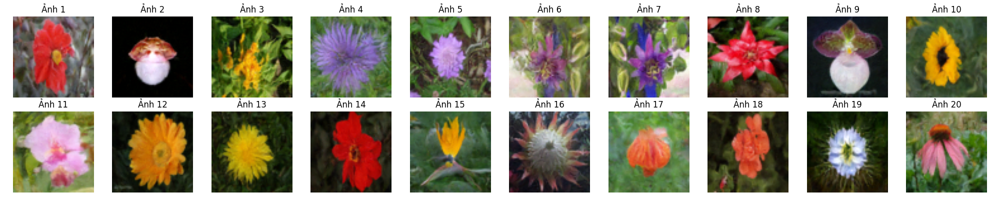
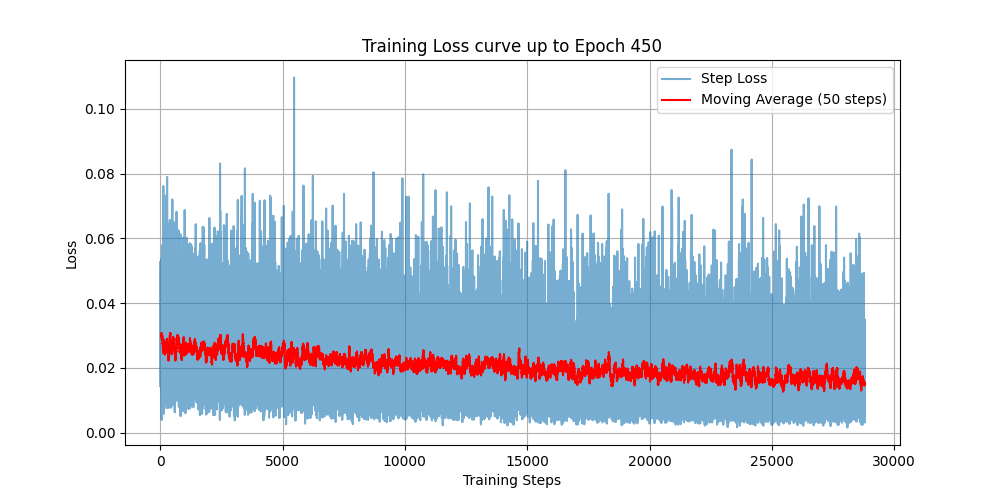

# PyTorch Denoising Diffusion Probabilistic Models (DDPM) for Flower Generation

[](https://pytorch.org/)
[](https://arxiv.org/abs/2006.11239)
[](#results)

This repository is a PyTorch reconstruction of the landmark paper **Denoising Diffusion Probabilistic Models (DDPM)** by Jonathan Ho et al. (2020), specifically applied to generate high-quality images of flowers using the **Flowers102** dataset. 

The trained model reaches an **FID (Fréchet Inception Distance) score of 46.2**, yielding clean, diverse, and realistic samples.

---

## 🌸 Generated Samples

Below is a grid of 20 random flower samples generated from noise by our pre-trained model checkpoint (`model_450_flower_pro.pth`):



---

## 🛠️ Architecture & Diffusion Details

This implementation closely follows the formulations and designs described in the DDPM paper:

### 1. Diffusion Process (Forward & Reverse)
* **Total Timesteps ($T$):** $1000$ steps.
* **Noise Schedule ($\beta_t$):** Linear schedule starting from $\beta_1 = 10^{-4}$ to $\beta_T = 0.02$.
* **Objective:** Predict the noise $\epsilon$ added at a random step $t$ using Mean Squared Error (MSE) loss:
  $$\mathcal{L}_{\text{simple}}(\theta) := \mathbb{E}_{t, x_0, \epsilon} \left[ \| \epsilon - \epsilon_\theta(x_t, t) \|^2 \right]$$

### 2. UNet Model Architecture
We implement a deep UNet matching the structural enhancements from the original paper's Appendix:
* **Time Embeddings:** Diffusion timestep $t$ is embedded using Sinusoidal Positional Embeddings, projected through a 2-layer MLP, and injected (added) into all ResNet blocks.
* **Normalization & Activations:** Group Normalization (with 32 groups) and SiLU activation functions are used throughout.
* **Self-Attention blocks:** Multi-Head Self-Attention layers are applied at the $16 \times 16$ feature resolution level to capture long-range global structures.
* **Resolutions:** The downsampling pass scales feature maps from $64 \times 64$ down to a bottleneck at $8 \times 8$ using 4 stages:
  * **Stage 1:** $64 \times 64$ (128 channels) — standard convolutional down-blocks.
  * **Stage 2:** $32 \times 32$ (256 channels) — standard convolutional down-blocks.
  * **Stage 3:** $16 \times 16$ (256 channels) — self-attention down-blocks.
  * **Stage 4:** $8 \times 8$ (512 channels) — standard convolutional down-blocks.
  * **Bottleneck:** $8 \times 8$ (512 channels) — self-attention block (no downsampling).

---

## 📂 Repository Structure

```text
MyDPM/
├── data/                      # Dataset root (auto-downloads Flowers102 / OxfordIIITPet)
├── models/                    # Model modules
│   ├── layers.py              # Custom layers (Attention, ResNet, PosEmbed, etc.)
│   └── unet.py                # Main UNet architecture
├── src/                       # Source files
│   ├── config.py              # Hyperparameters and noise schedules
│   └── DiffusionImage.py      # Dataset pipeline & forward diffusion process
├── loss_plots/                # Loss curves plotted during training
├── output_1/                  # Random generation samples captured during training
├── compute_fid.py             # Evaluation script to compute the FID score
├── plot_dataset.py            # Utility to visualize the raw dataset images
├── plot_samples.py            # Utility to generate and save 20 samples from checkpoint
├── train.py                   # Main training pipeline
├── test.py                    # Script to test and visualize the forward diffusion process
└── requirements.txt           # Python dependency requirements
```

---

## 🚀 Getting Started

### 1. Installation

Clone this repository and install the dependencies:

```bash
pip install -r requirements.txt
```

### 2. Run Scripts

#### A. Visualize Forward Diffusion Process
To check how noise is progressively added to an image during the forward diffusion process, run:
```bash
python test.py
```
This downloads a few sample images, processes them through the `DiffusionDataset` forward pass, and outputs a visual comparison named `check_diffusion_image.png`.

#### B. Generate Samples from Pre-trained Model
To generate a grid of 20 flower samples using our pre-trained model (`model_450_flower_pro.pth`), run:
```bash
python plot_samples.py
```
This saves the grid image to **`plot_20_samples.png`**.

#### C. Evaluate Model (FID Score)
To compute the FID score of the generated flowers against the real Flowers102 dataset (split='train') using Torchmetrics:
```bash
python compute_fid.py
```
This will automatically download the Flowers102 dataset, generate the corresponding number of fake samples, run them through an InceptionV3 network, and print the resulting FID score (our checkpoint achieves **`46.2`**).

#### D. Train the Model from Scratch
To start a new training run, execute:
```bash
python train.py
```
The script will save model checkpoints every 50 epochs and save loss plots to the `loss_plots/` directory.

---

## 📈 Results

### Training Loss Curve
Below is the training loss progression up to epoch 450:



### Fréchet Inception Distance (FID)
* **FID Score:** **`46.2`** (calculated using Torchmetrics with `feature=2048`, normalizing real and generated images to `[0, 1]`).
* Under standard interpretations:
  * **FID < 10:** SOTA quality.
  * **FID 10–50:** Good generation quality.
  * **FID 50–100:** Moderate/Acceptable generation quality.

---

## 📝 References

1. Ho, Jonathan, Ajay Jain, and Pieter Abbeel. "[Denoising diffusion probabilistic models.](https://arxiv.org/abs/2006.11239)" *Advances in Neural Information Processing Systems* 33 (2020): 6840-6851.
2. Vaswani, Ashish, et al. "[Attention is all you need.](https://arxiv.org/abs/1706.03762)" *Advances in neural information processing systems* 30 (2017).
